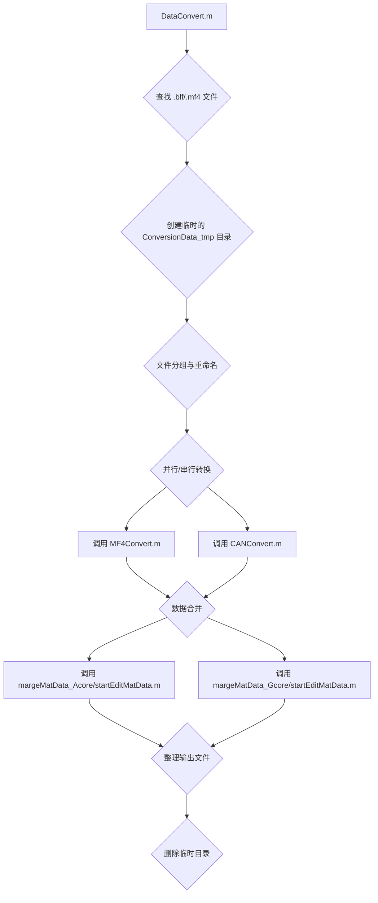
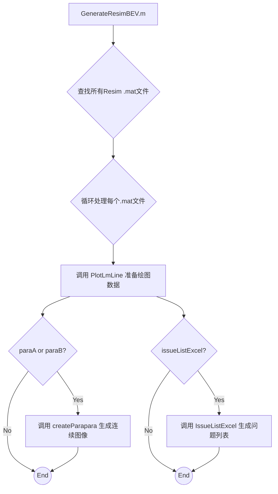
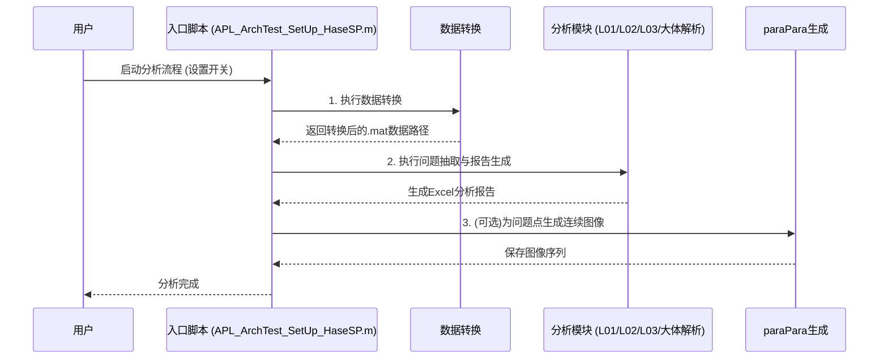

# 项目代码工程深度分析文档

## 1. 项目整体描述

### 1.1 问题背景
本项目旨在解决高级驾驶辅助系统（ADAS）或自动驾驶系统开发过程中，海量仿真与实车测试数据（`.mf4`, `.blf` 格式）的自动化分析难题。核心技术问题是通过自动化的工作流，高效地处理、转换、分析这些数据，以验证系统算法性能，并对已知问题或失效模式（Failure Mode）进行复现、定位和可视化，从而替代过去繁琐、低效的人工分析，加速研发迭代周期。

### 1.2 功能模块概览
项目围绕数据处理和问题分析构建了一个自动化的流水线，主要包含以下功能模块：

*   **数据转换 (DataConvert)**: 作为流水线的起点，负责将原始的 `.mf4` 和 `.blf` 日志文件转换为后续分析所需的标准化 `.mat` 格式。
*   **L01/L02/L03 分析报告生成**: 针对不同级别（L01/L02/L03）的问题，从问题列表中抽取特定事件，加载对应数据，自动生成包含图表、视频截图和地图链接的详尽Excel分析报告。
*   **大体解析 (General Analysis)**: 一个通用的对比分析引擎，核心是验证仿真（Resim）对原始数据（OnlyMF4）中问题的再现能力，并为每种问题类型生成独立的、图文并茂的对比分析报告。
*   **paraPara生成 (Sequential Image Generation)**: 可视化分析模块，负责为指定的问题点生成连续的、逐帧的鸟瞰图（BEV）等分析图像，用于直观地复现问题动态过程。

## 2. 功能模块详细设计

### 2.1 数据转换模块 (DataConvert)

#### 2.1.1 模块说明
本模块是整个仿真流程的数据预处理核心，负责将原始的 `.blf` (CAN消息) 和 `.mf4` (测量数据) 文件转换为标准的 `.mat` 格式，以便后续的仿真和分析模块使用。

#### 2.1.2 重点逻辑
1.  **文件发现与准备**:
    *   在指定的输入目录中搜索 `.blf` 和 `.mf4` 文件。
    *   创建一个临时的 `ConversionData_tmp` 目录，用于存放和处理当次运行的源文件，避免污染原始数据。

2.  **数据分组与重命名**:
    *   根据文件名中包含的时间戳 (`yyyyMMdd_HHmmss`) 对文件进行分组，将时间相近的文件归为一次记录。
    *   对特定条件下的文件名进行重命名，以统一格式，便于后续的自动化脚本进行调用 (例如，将 `ADASECU_6jikuSRS_CAN.blf` 重命名为 `ADASECU_CAN.blf`)。

3.  **并行与串行转换**:
    *   **MF4 转换**: 调用 `MF4Convert.m` 脚本。支持 `batch` 模式，允许在后台并行处理 MF4 文件，提高效率。
    *   **CAN 转换**: 调用 `CANConvert.m` 脚本，串行处理 CAN 日志数据。
    *   等待所有 `batch` 任务完成后，再进行后续的数据合并。

4.  **数据合并与整理**:
    *   调用 `margeMatData_Acore` 和 `margeMatData_Gcore` 目录下的 `startEditMatData.m` 脚本，将转换后的 Acore 和 Gcore 的 `.mat` 数据进行合并和结构化处理。
    *   将最终生成的 `.mat` 文件（如 `_ACore_XCP_remap.mat`, `_ADASECU_CAN.mat` 等）统一存放到 `Data/matdata/` 目录下的独立子文件夹中，并创建对应的空 `.blf` 文件作为转换完成的标记。

5.  **清理工作**:
    *   在所有操作完成后，删除临时的 `ConversionData_tmp` 目录，保持工作区的整洁。

#### 2.1.3 模块内部交互



#### 2.1.4 关键伪代码
```python
def data_convert(input_path, output_path, config):
    # 1. 准备临时工作目录
    temp_dir = create_temp_directory(input_path)
    
    # 2. 查找并按时间戳分组文件
    file_groups = find_and_group_files(temp_dir)
    
    # 3. 对每个分组进行处理
    for group in file_groups:
        # 3.1 文件重命名
        rename_files_for_consistency(group)
        
        # 3.2 并行转换 MF4
        mf4_job = batch_run("MF4Convert", group, config)
        
        # 3.3 串行转换 CAN
        can_results = run("CANConvert", group, config)
        
        # 3.4 等待 MF4 转换完成
        wait_for_job(mf4_job)
        mf4_results = get_job_output(mf4_job)
        
        # 3.5 合并数据
        merged_acore_data = run("margeMatData_Acore/startEditMatData", mf4_results)
        if config.has_gcore:
            merged_gcore_data = run("margeMatData_Gcore/startEditMatData", mf4_results)
            
        # 3.6 整理并输出最终的 .mat 文件
        organize_output_files(output_path, merged_acore_data, merged_gcore_data, can_results)

    # 4. 清理临时目录
    cleanup_temp_directory(temp_dir)

```

### 2.2 L01/L02 自动化分析报告模块

#### 2.2.1 模块说明
该模块是用于 L01/L02 级别问题点分析和报告生成的自动化核心。它通过读取预设的问题列表和仿真数据，全自动地生成一份包含图像、数据和超链接的综合性 Excel 分析报告，极大地提升了分析效率。

#### 2.2.2 重点逻辑
L01/L02模块的问题处理是一个清晰的两阶段过程：

1.  **问题的产生（规则定义）**:
    *   此阶段由核心脚本 `IssueListExcel.m` 完成，它负责从原始仿真数据中根据预设规则（检查诊断状态位）生成一份“B级原始问题清单”。这部分是所有B级问题的统一来源。

2.  **问题的筛选与报告生成（规则应用）**:
    *   L01/L02的主脚本 `main_new.m` 读取上述的“B级原始问题清单”。
    *   它应用一个非常具体的二次筛选规则：**只处理问题代码为 "728" (UnableToEstimateEgoLane) 的问题点**。
    *   最后，为这些经过筛选的问题点执行自动化分析（加载数据、截图、生成链接等），并生成最终的L01/L02 Excel报告。

#### 2.2.3 模块内部交互

mermaid
graph TD
    subgraph "阶段一：问题产生 (IssueListExcel.m)"
        A[仿真数据 .mat] --> B{应用B级问题规则};
        B --> C[B级原始问题清单 .xlsx];
    end
    
    subgraph "阶段二：问题筛选与报告 (main_new.m)"
        C --> D{读取B级清单};
        D --> E{筛选出 \"728\" 问题};
        E --> F{循环处理每个 \"728\" 问题};
        F --> G[加载数据/截图/生成链接];
        G --> H[写入L01/L02分析报告];
    end


#### 2.2.4 问题点抽取核心规则与源码解读

##### 阶段一：问题的产生 (源于 `IssueListExcel.m`)
matlab
% --- B级问题抽取: 基于“诊断状态位”的规则 ---

% (此部分代码与L03模块分析中的B级问题抽取规则完全相同，是所有B级问题的产生源头)

% 步骤 1: 定义规则列表
chkFlgListAll = ["bitget(lmPldStt,17)","bitget(lmPldStt,16)",...\
                  "bitget(lmPldStt,6)","bitget(lmPldStt,5)",...\
                  "bitget(lmPldStt,24)","bitget(lmPldStt,25)",...\
                  "bitget(lmPldStt,18)","bitget(lmPldStt,21)",...\
                  "bitget(lmPldStt,19)","bitget(lmPldStt,20)"];
chkFlgNameList = ["724","723","711","710","731","732","725","728","726","727"];

% 步骤 2: 批量执行所有规则检查并定位“上升沿”
% ... (此处省略与L03分析中完全相同的eval循环和chkPLDFlgIdx计算代码) ...
chkPLDFlgIdx = double(chkFlgListTmp).*LMPldSttIdxInvZ;

% 步骤 3: 处理重叠问题
PLDoverLap;

% 步骤 4: 遍历并记录所有B级问题到原始问题清单Excel中
% ... (此处省略与L03分析中完全相同的for循环和Excel写入伪代码) ...


##### 阶段二：问题的筛选 (源于 `main_new.m`)
matlab
% --- L01/L02 问题点筛选逻辑 (在主报告生成脚本中) ---

% 前提: B级“原始问题清单”已经由 IssueListExcel.m 生成完毕。
% 本脚本读取这些清单，并根据特定规则筛选出L01/L02报告真正关心的问题。

issueListB_path = fullfile(currentDir,'\data\issueList\B');
issueListB_files = dir(issueListB_path);

% 遍历所有B级问题清单Excel文件
for i = 3:length(issueListB_files)
    BfilePath = fullfile(issueListB_files(i).folder, issueListB_files(i).name);
    [~,~,RawData] = xlsread(BfilePath);
    % % ... (省略数据清洗代码) ...
    
    % 遍历Excel中的每一列
    for c = 1:size(RawData, 2)
        % 遍历列中的每一行
        for r = 3:size(RawData, 1)
            if RawData(r,c) ~= ""
                % 从单元格内容中解析出 PLDStatus (问题代码)
                infoRaw = split(RawData(r,c),'#');
                PLDStatus = infoRaw(2);
                
                % 核心筛选规则: 只处理问题代码为 "728" (UnableToEstimateEgoLane) 的问题点
                if contains(PLDStatus,"728")
                    % 提取数据文件名、时间等信息
                    dataNameAll = char(RawData(1,c));
                    issueTime = regexp(RawData(r,c),'time_(\d+\.?\d*)','match');
                    
                    % % 将筛选出的问题点信息写入L01/L02主分析Excel表 (伪代码)
                    % main_report_sheet.Range(cell_address).value = ...;
                end
            end
        end
    end
end


### 2.3 L03 自动化分析报告模块

#### 2.3.1 模块说明
本模块是专为 L03 级别问题（通常与高精度定位相关）设计的自动化分析与报告生成引擎。它读取 L03 相关的问题列表，并结合转换后的仿真数据，自动生成包含丰富可视化图表和数据的 Excel 分析报告。

#### 2.3.2 重点逻辑
1.  **问题点抽取与输入表生成**：
    *   通过 `writeDataNameIssue` 脚本，直接从源头问题列表（如 `L03_Localization_V00.xlsx`）读取问题点。
    *   将抽取出的问题（包含数据文件名和时间戳）预先填入多个 L03 分析报告 Excel 表中。这一步同时完成了“问题点抽取”和“解析输入表生成”两个任务。

2.  **多报告文件处理**：
    *   脚本设计为可以循环处理多个 L03 分析报告 Excel 文件，对每个文件独立进行完整的分析和生成流程。

3.  **核心分析流程**：
    *   **数据加载与预处理**：加载与问题点对应的 `.mat` 数据文件，并调用 `obtainCorrectTime` 对时间信号进行校正。
    *   **Freeze状态检测**：在处理前，检查问题时间戳是否超出了 Resim 数据的最大时间范围，如果超出则标记为“Freeze”状态，并跳过部分分析。
    *   **可视化分析**：调用 `start_BEV` 脚本生成核心的鸟瞰图(BEV)；调用 `GoogleMapLinks` 生成定位地图链接；调用 `plotPointFrameOfAvi` 从视频中截取关键帧图像。

4.  **结果汇总与报告美化**：
    *   将所有生成的分析结果，包括车辆编号、地图链接、分析图和视频截图，通过 `savePicsToExc` 等函数嵌入到 Excel 表格的相应位置。
    *   对 Excel 工作表进行全面的格式化，包括设置 VLOOKUP 查询公式、行高、列宽、对齐方式、字体和边框，确保报告的专业性和可读性。

#### 2.3.3 模块内部交互

mermaid
graph TD
    A[main.m] --> B{循环处理每个L03 Excel报告文件};
    B --> C[调用 writeDataNameIssue 抽取问题并填充Excel];
    C --> D{读取Excel中的任务列表};
    D --> E{按dataName分组};
    E --> F{循环处理每个数据组};
    F --> G[加载数据并校正时间];
    G --> H{检测Freeze状态};
    H --> I[生成BEV图(start_BEV)];
    H --> J[视频截图(plotPointFrameOfAvi)];
    H --> K[地图链接(GoogleMapLinks)];
    I & J & K --> L{回写结果到Excel};
    L --> M{格式化Excel并保存};
    M --> B;


#### 2.3.4 关键伪代码

python
def l03_auto_report_generator(config):
    # 1. 识别所有L03报告文件
    report_files = find_files(config.l03_report_path, "L03_*.xlsx")
    
    # 2. 循环处理每个报告文件
    for report_path in report_files:
        excel_app = open_excel_application()
        report_workbook = excel_app.open(report_path)
        
        # 2.1 问题点抽取与填充 (假设已由writeDataNameIssue完成)
        # write_issues_to_report(report_workbook, config.source_issue_list)
        
        # 2.2 解析输入表
        analysis_tasks = read_tasks_from_report(report_workbook)
        task_groups = group_tasks_by_data_name(analysis_tasks)
        
        # 2.3 循环分析每个数据组
        for data_name, issues in task_groups.items():
            sim_data = load_mat_files(config.data_path, data_name)
            # 时间校正
            sim_data.time = correct_time_signal(sim_data.time)
            
            for issue in issues:
                # 检测Freeze
                if is_data_frozen(sim_data, issue.timestamp):
                    mark_issue_as_frozen(report_workbook, issue.row)
                    continue
                
                # 生成BEV图、截图、地图链接
                bev_plot = generate_bev_plot(sim_data, issue.timestamp)
                snapshot = generate_video_snapshot(config.video_path, issue.timestamp)
                map_link = generate_google_map_link(sim_data, issue.timestamp)
                
                # 回写结果
                update_report_with_results(report_workbook, issue.row, bev_plot, snapshot, map_link)
                
        # 2.4 格式化并保存
        format_excel_report(report_workbook)
        report_workbook.save()
        excel_app.quit()


#### 2.3.5 问题点抽取核心规则与源码解读
B级问题是基于一个名为 `lmPldStt` (Lane Plan Diagnosis Status) 的诊断信号的特定状态位来触发的。

matlab
% --- B级问题抽取: 基于“诊断状态位”的规则 ---

% 步骤 1: 定义规则列表
% chkFlgListAll: 包含要执行的检查逻辑的字符串数组，每个字符串都是一条MATLAB命令用以检查特定状态位。
% chkFlgNameList: 与上一行一一对应的“问题代码”(ID)，例如"724"。
chkFlgListAll = ["bitget(lmPldStt,17)","bitget(lmPldStt,16)",...\
                  "bitget(lmPldStt,6)","bitget(lmPldStt,5)",...\
                  "bitget(lmPldStt,24)","bitget(lmPldStt,25)",...\
                  "bitget(lmPldStt,18)","bitget(lmPldStt,21)",...\
                  "bitget(lmPldStt,19)","bitget(lmPldStt,20)"];
chkFlgNameList = ["724","723","711","710","731","732","725","728","726","727"];

% 步骤 2: 批量执行所有规则检查
chkFlgListTmp = [];
for i=1:length(chkFlgListAll)
    % 使用 eval 命令动态执行字符串形式的检查逻辑，对整个时间序列进行检查
    chkFlgListTmp = [chkFlgListTmp,eval(chkFlgListAll(i))];
end

% 步骤 3: 定位问题的“上升沿” (Rising Edge)
% LMPldSttIdxInvZ 是一个预先计算好的辅助信号，值为0或1。
% 其作用是确保只在问题首次出现的那一刻(状态从0变为1)进行记录，从而避免在整个问题持续期间重复报告。
chkPLDFlgIdx = double(chkFlgListTmp).*LMPldSttIdxInvZ;

% 步骤 4: 处理重叠问题
% 如果同一时刻触发了多个问题，由该脚本进行仲裁，按预设优先级选择一个最终问题进行报告。
PLDoverLap;

% 步骤 5: 遍历每一种问题类型，整理并记录结果
for PLDListCnt=1:length(chkFlgNameList)
    % 找出当前类型问题发生的所有时间点索引
    chkPLDFlgIdxPartTmp = chkPLDFlgIdx(:,PLDListCnt).*(1:length(S_lmPldStt.time))\''\''';
    chkPLDFlgIdxPart = chkPLDFlgIdxPartTmp(chkPLDFlgIdxPartTmp~=0);
    
    % % (此处省略与其他来源的问题列表进行合并的逻辑)

    % 如果找到了该类型的问题点
    if ~isempty(chkPLDFlgIdxPart)
        chkList = chkFlgNameList(PLDListCnt);
        % 遍历该类型的每一个问题点
        for i = 1:length(chkPLDFlgIdxPart)
            l = chkPLDFlgIdxPart(i); % 获取问题点的时间索引
            
            % 调用另一个脚本，获取更详细的问题分类，结果存入变量 classification
            detailClassificationResim;
            
            % % (此处省略根据详细分类构造问题名称的逻辑)
            
            % 构造最终写入Excel的字符串，包含车速、问题名、时间戳等信息
            speed = string(sprintf('\''%.1f\''',S_egoSpd.signals.values(l)*3.6));
            A3value = strcat(speed, '\''#\''', chkListName, "\"#\"", ...
            "time_", string(sprintf("%0.2f",time(l))),"[sec].png");
            
            % % 将问题字符串写入Excel单元格 (伪代码)
            % Sheet.Range(cell_address).value = A3value;
        end
    end
end


A级问题是基于车辆的物理状态（主要是横向误差）是否超出预设阈值来触发的。

matlab
% --- A级问题抽取: 基于“物理量阈值”的规则 ---

% 前提：已加载好 gapValue (横向误差序列) 和 eMap (eMap状态序列) 信号

% 步骤 1: 定义核心规则并找出所有违反规则的“原始”问题点
LATERAL_DEVIATION_THRESHOLD = 0.4; % 横向误差阈值定义为0.4米
ZZ_search03mGapStep = []; % 用于存储所有违反规则的时间点索引

for gapIndex=1:length(gapValue)
    % 核心规则: 横向误差的绝对值 > 0.4米 并且 eMap状态为0
    if abs(gapValue(gapIndex)) > LATERAL_DEVIATION_THRESHOLD && eMap(gapIndex) == 0
        ZZ_search03mGapStep = vertcat(ZZ_search03mGapStep,gapIndex);
    end
end

% 步骤 2: 从连续的原始问题点中，找到代表性的“峰值”点
% 目的是将一个连续的问题事件(可能持续数秒)浓缩成一个点进行报告，避免冗余。
indexList = [];
maxIndex = [];
for i = 1:length(ZZ_search03mGapStep)
    currentIndex = ZZ_search03mGapStep(i);

    % 检查当前点是否与上一个点在时间上连续
    if isempty(maxIndex) || currentIndex ~= ZZ_search03mGapStep(i-1) + 1
        % 如果不连续，说明上一个事件段已结束，将其峰值点存入列表
        indexList = [indexList; maxIndex];
        % 开始一个新的事件段，暂时将当前点视为当前段的峰值点
        maxIndex = currentIndex;
    else
        % 如果是连续的，则比较当前点的误差与当前事件段已记录峰值点的误差大小
        if abs(tgtDiffy(currentIndex)) > abs(tgtDiffy(maxIndex))
            % 如果当前点的误差更大，则更新当前事件段的峰值点
            maxIndex = currentIndex;
        end
    end
end
% 将最后一个事件段的峰值点存入列表
indexList = [indexList; maxIndex];
indexList = sort(unique(indexList)); % 去重和排序

% 步骤 3: 提取峰值点的数据并准备写入Excel
gapList = gapValue(indexList); % 提取峰值点的横向误差值
gapTime = time(indexList);     % 提取峰值点的时间戳

% % (此处省略将时间戳转换为视频时间等格式化步骤)

% 步骤 4: 将最终问题追加写入A级Excel文件 (伪代码)
% raw = read_excel(withAExcel);
% new_data = format_for_excel(folderName, gapTime, gapList);
% raw(start_row:end_row, columns) = new_data;
% xlswrite(withAExcel,raw);


### 2.4 大体解析 (通用对比分析) 模块

#### 2.4.1 模块说明
本模块是一个通用的、以对比分析为核心的自动化报告生成引擎。它旨在验证仿真（Resim）环境对真实世界数据（OnlyMF4）中出现的特定问题的再现能力。其输出是一系列按问题类型分类的、高度详细的Excel报告，每个报告都深度剖析一个具体的问题实例。

#### 2.4.2 重点逻辑
“大体解析”模块的问题处理同样是“产生-消费”模式：

1.  **问题的产生（规则定义）**: 
    *   与L01/L02模块一样，此阶段由核心脚本 `IssueListExcel.m` 完成，它负责生成一份“B级原始问题清单”，作为本模块的数据源之一。

2.  **问题的消费与对比分析（规则应用）**:
    *   主脚本 `runAnalysis.m` 同时读取 `OnlyMF4` 和 `Resim` 两种来源的“B级原始问题清单”。
    *   它根据一个广泛的关注列表 (`chkFlgName`) 从清单中筛选出所有相关的问题点。
    *   核心功能是调用 `findResimTime` 等逻辑，在两类问题中寻找匹配对，以判断问题是否成功再现。
    *   最后，为每个问题对生成包含并排分析图（`GenerateResimPara`）和视频截图的深度对比报告。

#### 2.4.3 模块内部交互

mermaid
graph TD
    subgraph "阶段一：问题产生 (IssueListExcel.m)"
        A[仿真数据 .mat] --> B{应用B级问题规则};
        B --> C[B级原始问题清单 .xlsx];
    end
    
    subgraph "阶段二：问题消费与对比分析 (runAnalysis.m)"
        C --> D{读取OnlyMF4和Resim的B级清单};
        D --> E{按chkFlgName列表筛选问题};
        E --> F{寻找OnlyMF4与Resim的匹配对};
        F --> G{循环处理每个问题对};
        G --> H[生成并排对比图/截图];
        H --> I[写入独立的对比分析Excel];
    end


#### 2.4.4 问题点抽取核心规则与源码解读

##### 阶段一：问题的产生 (源于 `IssueListExcel.m`)
matlab
% --- B级问题抽取: 基于“诊断状态位”的规则 ---
% (此部分为所有B级问题的统一产生源头，是本模块的输入数据源，代码省略，详见L01/L02或L03模块分析)


##### 阶段二：问题的消费与筛选 (源于 `runAnalysis.m`)
matlab
% --- 大体解析 问题点消费与筛选逻辑 ---

% 前提: B级“原始问题清单”已经由 IssueListExcel.m 生成完毕。
% 本脚本读取这些清单，并按关注的问题代码列表进行分类，用于后续的对比分析。

% 步骤 1: 定义关注的问题代码列表
chkFlgName = ["724","723","711","710","731","732","725","728","726","727"];

% 步骤 2: 读取 "OnlyMF4" B级问题列表 (对 Resim 问题列表执行类似操作)
OnlyBIssueListDir = dir(fullfile(currentDir,'data','IssueList','B','*Only*'));
for i = 1:length(OnlyBIssueListDir)
    OnlyBIssueListPath = fullfile(OnlyBIssueListDir(i).folder, OnlyBIssueListDir(i).name);
    [~,~,DataDetail] = xlsread(OnlyBIssueListPath);
    
    % 步骤 3: 根据关注列表，遍历并抽取问题
    for p = 1:length(chkFlgName)
        % 遍历Excel的每一列
        for j = 1:size(DataDetail, 2)
            % 检查当前列的字符串数组是否包含任一关注的问题代码
            indices = contains(DataDetail(:,j),chkFlgName(p));
            if any(indices)
                % 如果包含，则遍历所有匹配的行
                for k = 1:length(indices)
                    if indices(k) == 1 &&  k > 2 % 跳过表头
                        % 解析单元格内容，提取速度、问题点、类型等详细信息
                        infoDataDetail = split(string(DataDetail(k,j)),'#');
                        point = infoDataDetail(3);
                        spd = infoDataDetail(1);
                        
                        % % 将提取出的问题存入 NameListOnlyMF4 结构体，用于后续处理
                        % NameListOnlyMF4(row+1,1).name = DataDetail(1,j);
                        % NameListOnlyMF4(row+1,1).point = point;
                        % ...
                    end
                end
            end
        end
    end
end

% % (后续代码使用 NameListOnlyMF4 和类似方法提取的 NameListLatestResim 
% %  结构体进行 findResimTime 对比和 GenerateResimPara 绘图)


### 2.5 paraPara生成 (连续图像生成) 模块

#### 2.5.1 模块说明
本模块是项目中核心的可视化结果生成单元，负责为指定的问题点创建连续的、逐帧的分析图像（paraPara），通常是鸟瞰图（BEV）。它通过一个顶层脚本驱动，对所有可用的仿真结果进行批量处理，生成直观的、用于复现和分析问题的动态过程图。

#### 2.5.2 重点逻辑
1.  **数据驱动的批量处理**：
    *   脚本首先在 `data/matdata` 目录中自动查找所有已经转换完成的仿真结果（`.mat` 文件）。
    *   以文件为单位，对每一个仿真结果进行循环处理，具有良好的扩展性。

2.  **任务调度与分发**：
    *   `GenerateResimBEV.m` 作为总调度器，根据外部传入的布尔标志位（`issueListExcel`, `paraA`, `paraB`）来决定执行哪些任务。
    *   这种设计使得模块功能可以灵活组合，既可以只生成问题列表，也可以只生成 `paraPara` 图像，或者两者都执行。

3.  **核心绘图逻辑的解耦**：
    *   基础数据处理（`PlotLmLine`）、问题列表生成（`IssueListExcel`）和核心的 `paraPara` 图像生成（`createParapara`）被分离到不同的脚本中。
    *   `GenerateResimBEV.m` 负责“做什么”，而 `createParapara.m` 等脚本负责“怎么做”，体现了良好的职责分离原则。

4.  **受控的执行环境**：
    *   在每次循环的末尾，脚本会小心地清理工作空间中的变量，只保留必要的全局变量，避免了不同数据处理过程之间的相互干扰。

#### 2.5.3 模块内部交互



#### 2.5.4 关键伪代码

```python
def generate_resim_bev_parapara(config):
    # 1. 查找所有仿真结果数据
    simulation_results = find_files(config.matdata_path, "*.mat")
    
    # 2. 循环处理每个结果
    for result_file in simulation_results:
        # 保存当前上下文，用于循环后恢复
        workspace_context = save_workspace()
        
        # 3. 准备绘图数据
        line_data = plot_lm_line(result_file)
        
        # 4. 根据配置分发任务
        if config.generate_issue_list:
            generate_issue_list_excel(line_data)
            
        if config.generate_para_A or config.generate_para_B:
            # 核心：调用paraPara生成脚本
            create_parapara_plots(line_data, config)
            
        # 清理工作空间，避免干扰下一次循环
        restore_workspace(workspace_context)

```

## 3. 模块间调用关系



## 4. 代码读取与分析
本项目代码的分析遵循“自顶向下”的原则。
1.  **确定入口**：从顶层入口脚本 `APL_ArchTest_SetUp_HaseSP.m` 开始。
2.  **链路追踪**：使用 `matlab_recursive_analyze` 工具获取从入口到所有功能叶子节点的完整调用链。
3.  **逐层深入**：沿着调用链，使用 `read_file` 工具逐个读取核心脚本和函数，理解其输入、输出和核心逻辑。对于行数较多的文件，通过分段阅读和关键函数/循环的定位来把握其主干逻辑。
4.  **模块归纳**：将功能相近、调用关系紧密的脚本和函数归纳为一个“功能模块”，并参照本文档的格式进行总结和伪代码编写。

## 5. 工具使用说明
`matlab_recursive_analyze` 工具是本次分析的基石，其使用方法如下：
1.  **调用方式**：通过 `matlab_recursive_analyze(entry_script="APL_ArchTest_SetUp_HaseSP.m")` 进行调用。
2.  **信息解析**：工具返回一个JSON对象，其中 `analysis_to_leaves` 字段包含了从入口脚本到所有被调用的叶子脚本的完整路径数组。
3.  **指导分析**：通过分析这些路径，可以清晰地了解项目的宏观结构和模块间的实际依赖关系，从而确定各个功能模块的范围和分析重点。例如，所有经过 `DataConvert.m` 的调用链都归属于“数据转换”模块。
